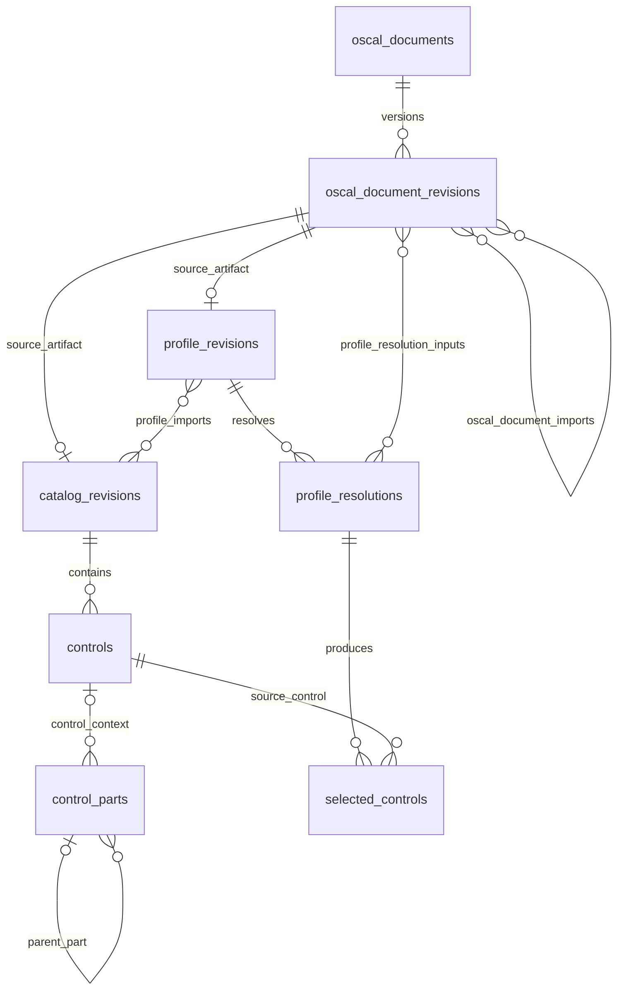
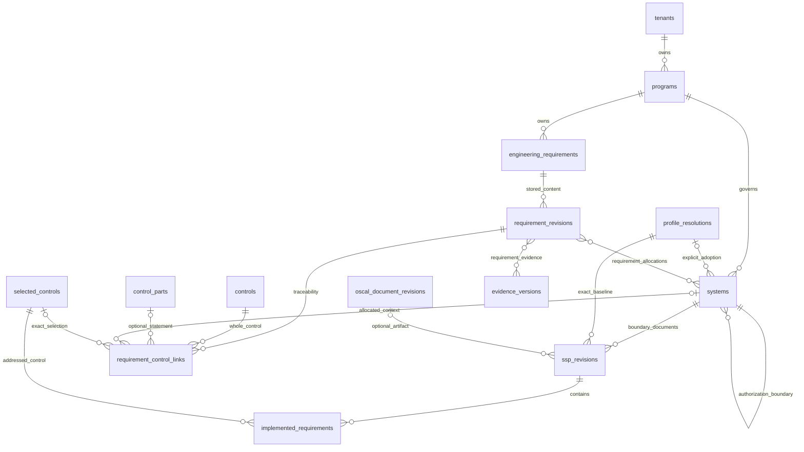
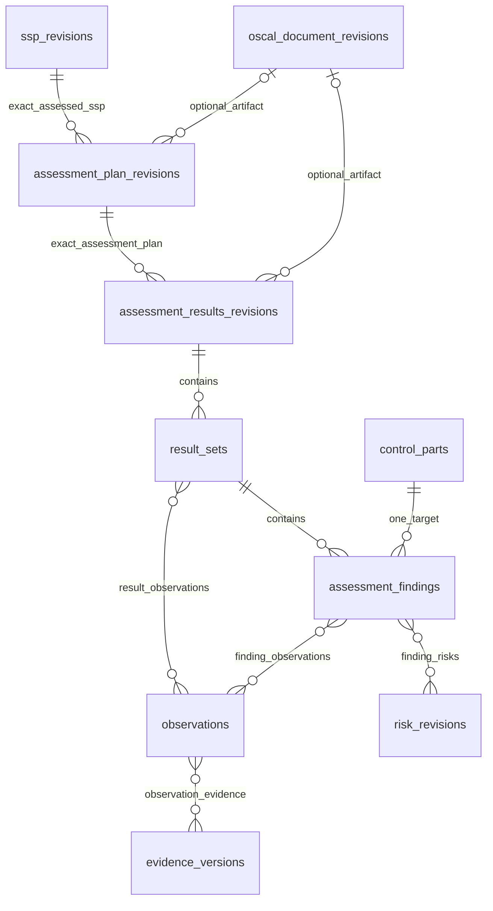
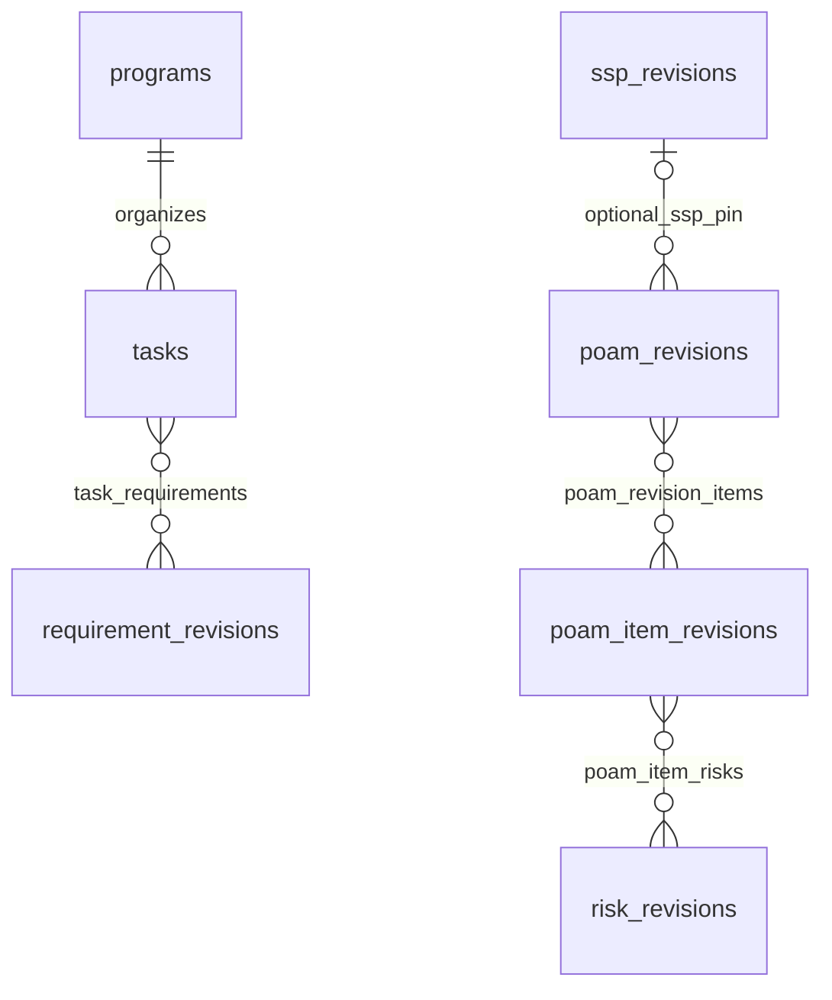
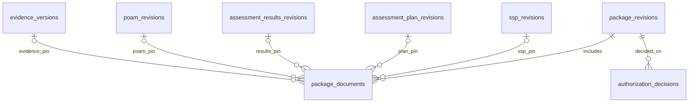

# Implemented schema ERD

For the intended system-centered workflow and the gaps in this implementation, see [System assurance workflow](system-assurance-workflow.md). The diagrams below describe the current storage model.

The application stores tenancy, OSCAL/reference content, assurance records, and assessment/workflow records in `public`. Compatibility views and private migration recovery tables are identified separately by the schema inspector.

The diagrams show the main relationships. Repeated names refer to the same table. Each many-to-many edge names its junction table; supporting configuration tables and columns are omitted. `||` means exactly one, `|o` means zero or one, and `o{`/`}o` means zero or many. These are database relationships, not workflow steps.

## Ownership boundary

`tenant_memberships` links Supabase `auth.users` to `tenants` with an `owner`, `admin`, `editor`, or `viewer` role. `parties` records actual people and organizations; a party may optionally link to an Auth user. Program role assignments identify responsibilities without granting database permissions.

Operational records require `tenant_id`. Their relationships preserve tenant identity through composite foreign keys. OSCAL/reference tables allow `tenant_id = NULL` for shared reference publications, or a tenant UUID for private authored content. Authenticated users can read shared references; application clients cannot write shared rows. A tenant record may reference a shared publication or its own tenant's content, with foreign keys and triggers enforcing that boundary.

## OSCAL publications and resolved control sets

`oscal_document_revisions` retains the source UUID, OSCAL version, document version, original URI, content hash, original JSON, and metadata. Document imports can preserve an unresolved URI or pin a specific referenced revision. Catalog and profile identities, source authorities, resources, groups, parameter choices/constraints/values, tailoring rules, and selection provenance are supporting tables.

A control part may belong to a control, a catalog group, or the catalog itself; the optional control relationship above preserves that distinction. Nested parts preserve their source identifiers and hierarchy. Profile imports select either a catalog revision or another profile revision. A resolution pins its input document revisions and resulting controls. The installed importer resolves the bundled NIST profiles' explicit selections and unchanged catalog ordering.

CCI releases, items, types, original publication references, and control links occupy separate tables. A source control index produces a control link; it does not imply an assessment-objective mapping. [Reference schema and seeding details](reference-seeding.md) · [Reference migration](../supabase/migrations/20260912000000_reference_schema.sql)

## Programs, system implementation, and engineering

An implemented requirement is an SSP implementation claim for one selected control. An engineering requirement is an independently authored statement with acceptance criteria and optional control mappings. Requirements now use direct edits and edit history. The existing `requirement_revisions` table retains current content and any previously stored rows for foreign-key compatibility; new edits update the current row in place. [Requirement edit persistence](requirement-edit-history.md) describes this behavior. Implementation statements and component contributions provide the more detailed implementation records beneath this overview.

The canonical `systems` tree separates containment from authorization-boundary ownership. `composition_nodes` forwards legacy reads/writes to that tree. SSP component records bridge to canonical elements through explicit or unambiguous inventory relationships; reusable definitions remain separate. Configuration baselines pin component versions and parameter values. Requirement allocations name exactly one root/nested system, provider capability, or security process. Published provider offerings and explicit inheritance acceptances preserve the implementation versions accepted by consumers. [Complete assurance model](assurance-schema.md) · [Assurance migration](../supabase/migrations/20260912010000_assurance_schema.sql)

## Assessment conclusions and evidence

Assessment campaigns own plan revisions. Planning records include objectives, activities, subjects, events, scheduled tasks, and dependencies. Execution uses `test_runs` pinned to published procedure and configuration revisions; ordered step results may source observations. Evidence versions belong to stable evidence artifacts and identify actual private Storage objects or external locations.

A finding targets one control part and records a determination separately from observations, risk, and evidence-review decisions. Findings can have several supporting observations and no associated risk. `operational_issues` is the separate operational deficiency register; it is not the formal finding table.

The normalized SSP, assessment, and POA&M records provide the application model. Optional OSCAL artifact references preserve imported or associated documents. `ssp_revisions` retains an optional `oscal_uuid` and an optional `oscal_document_revision_id` foreign key; its other version links are to the system, resolved profile, and optional configuration baseline. Component-definition revisions also support an optional OSCAL document revision reference.

## Work and remediation commitments

Tasks also have typed links to implementations, issues, risks, POA&M items, and assessment work. `poam_documents` and `poam_items` supply stable identities. A POA&M document revision pins exact published item revisions through `poam_revision_items`; a previously published item revision can be reused in another document revision. Milestones, observations, and risk links belong to the item revision. General task completion, assessment satisfaction, risk acceptance, and authorization remain distinct recorded facts.

## Reviewed packages and authorization

Each `package_documents` row sets **exactly one** of the five revision/version foreign keys shown. These are typed operational revision pins; there is no generic document-ID field substituting for those relationships. `authorization_packages` supplies the stable package identity and its system/program context. Authorization decisions cite the exact package revision and record the deciding party, rationale, and decision time. Gates, criteria, reviews, assignments, comments, change requests, and ingestion records surround these artifacts in the workflow layer. [Complete assessment/workflow model](workflow-schema.md) · [Workflow migration](../supabase/migrations/20260912020000_workflow_schema.sql)

## Version and data semantics

Database UUIDs identify records; human codes and source IDs are separate fields. The integer `revision` is an optimistic-concurrency counter. Authored `version_number`, source document version, and OSCAL version have separate meanings. Published revisions and their content cannot be rewritten; completed executions and recorded decisions have their own immutability guards. Package and assessment links retain the actual versions reviewed.

Operational tables start empty. Account bootstrap creates only a workspace, membership, and identity party from the signed-in account. Unknown business values remain `NULL`; controlled choices and constraints are read from the database by `app_schema()`. Reference seeding inserts the pinned publications, not programs, implementation claims, test outcomes, evidence, risks, or decisions.

The core tables originate in [tenancy](../supabase/migrations/20260911020000_tenancy.sql), [reference](../supabase/migrations/20260912000000_reference_schema.sql), [assurance](../supabase/migrations/20260912010000_assurance_schema.sql), and [workflow](../supabase/migrations/20260912020000_workflow_schema.sql) migrations. [Application metadata](../supabase/migrations/20260912030000_application_metadata.sql) exposes those constraints and retires the snapshot API; [evidence publication](../supabase/migrations/20260912040000_evidence_publication.sql) requires an uploaded object or external URI and rejects unfinished reserved uploads at publication.
