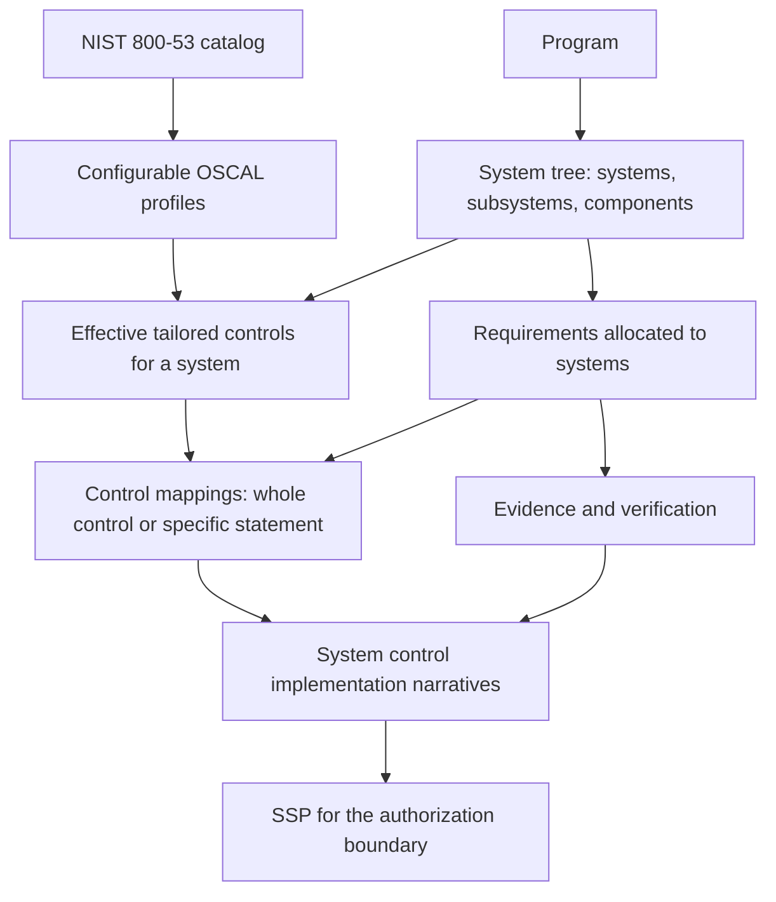

# System assurance workflow

The product is organized around a program's systems and their requirements. OSCAL supplies the reference catalogs, profiles, and SSP representation. The local application uses one canonical system tree, explicit system requirement allocations, effective profile inheritance, and whole-control mappings with optional statement precision. This document records those relationships, source-data limits, and the SSP assembly scope.

## Intended relationships

An authored requirement describes what a system must do. A functional requirement such as nonvolatile storage can exist without a security-control mapping. A security requirement such as encryption at rest can map to one or more controls in the system's effective baseline. Several requirements and several system contributions can support the same control.

Containment and requirement decomposition are separate relationships: a component belongs inside another system element; a child requirement refines another requirement. The UI should say **Parent requirement** for the latter. A control mapping does not by itself claim that a control is satisfied.

Nested elements inherit the nearest explicitly adopted ancestor profile inside their authorization boundary. A node may deliberately override that profile. Boundary ownership is distinct from containment: an independently bounded child has its own profile/SSP context and does not inherit across that boundary. Existing boundary SSP selections provide a fallback where no explicit adoption exists; no adoption event is invented during migration.

The system's implementation narrative explains how the control is implemented. Linked requirements and evidence provide traceability. Evidence attachment, implementation status, verification results, and assessment conclusions remain separate recorded facts. Aggregation must preserve the contributing system and requirement, expose gaps, and avoid silently declaring compliance.

OSCAL profiles select and tailor catalog content. An SSP references the applicable baseline and describes implementation at system or component level. The engineering-requirement workflow is an application layer connected to those OSCAL structures. See the NIST [profile model](https://pages.nist.gov/OSCAL/learn/concepts/layer/control/profile/) and [SSP model](https://pages.nist.gov/OSCAL/learn/concepts/layer/implementation/ssp/).

## What is implemented, and what is missing

| Product concept                 | Existing storage                                                                                                                                                                                                                                                                                                                                                                 | Gap to correct                                                                                                                                                                                                                                                                                                                                                                          |
| ------------------------------- | -------------------------------------------------------------------------------------------------------------------------------------------------------------------------------------------------------------------------------------------------------------------------------------------------------------------------------------------------------------------------------- | --------------------------------------------------------------------------------------------------------------------------------------------------------------------------------------------------------------------------------------------------------------------------------------------------------------------------------------------------------------------------------------- |
| Program with nested systems     | `programs` → canonical `systems.parent_system_id`; `boundary_system_id` owns SSP context                                                                                                                                                                                                                                                                                         | Existing composition UUIDs and metadata are preserved. `composition_nodes` is a compatibility view; the original table is an inaccessible, read-only recovery archive.                                                                                                                                                                                                                  |
| Element surfaces                | `ProgramSystemsTree`, `SystemAssuranceDetails`, `ProgramSystemRecord` over `useSystemAssurance`                                                                                                                                                                                                                                                                                  | One anatomy at every level: the tree (Element, Code, Type, C/I/A, Baseline, Controls, Requirements), the preview as the record's first screen, the record's tabs Overview · Controls · Requirements · Library · Inventory, SSP on the boundary only; the tab is in the URL. Scopes are a register under the program's Assessments tab. See `docs/guides/system-view-simplification.md`. |
| Library reuse                   | `component_definitions.category`, versions with conditions and responsibilities, claims with coverage, `defined_component_evidence`, `requirement_definitions`/`_revisions`, `library_assignments`/`_targets`, `evidence_uses`, the applied facts on `system_components`, `component_contributions.library_implementation_id`, `engineering_requirements.definition_revision_id` | Add from library applies a profile, a component definition or a requirement definition to elements through `apply_library_source`, `adopt_requirement_definition` and the existing baseline command; `decide_evidence_use` and `update_library_assignment` complete the lifecycle. Generic writes cannot fake an application. See `docs/guides/system-view-simplification.md`.          |
| System control baseline         | `systems.adopted_profile_resolution_id`, `system_effective_baselines`, OSCAL profile/resolution tables                                                                                                                                                                                                                                                                           | Adopt a published profile or tailor controls in a dialog. Explicit changes have CAS and idempotent request handling. Existing SSP pins remain unchanged, making profile drift visible.                                                                                                                                                                                                  |
| System requirements             | `engineering_requirements`, current `requirement_revisions` content, `requirement_allocations.system_id`                                                                                                                                                                                                                                                                         | Allocate to exact root or nested system IDs; selecting a parent does not silently allocate descendants. Existing provider/process allocations remain valid. Edits update in place with edit history.                                                                                                                                                                                    |
| Requirement control mapping     | `requirement_control_links.control_id`, optional `control_part_id`, optional recorded `system_id`/`selected_control_id`                                                                                                                                                                                                                                                          | New system mappings use an allocated system's effective selection. A statement is optional; assessment methods are rejected. Verified seed catalog references retain no inferred system context.                                                                                                                                                                                        |
| Implementation and traceability | `implemented_requirements`, `implementation_statements`, `component_contributions`, `requirement_implementations`                                                                                                                                                                                                                                                                | The SSP assembly starts from selected controls, including missing narratives. Explicit implementation links are distinct from requirement/control traceability.                                                                                                                                                                                                                         |
| Evidence                        | `evidence_artifacts`, `evidence_versions`, `requirement_evidence`, `implementation_evidence`                                                                                                                                                                                                                                                                                     | Links pin exact published versions. Supporting requirements and direct control/statement/component evidence are distinguishable. Draft metadata with no content remains a draft.                                                                                                                                                                                                        |
| SSP                             | `ssp_revisions` plus implementation/support tables                                                                                                                                                                                                                                                                                                                               | A boundary assembly preview brings records and gaps together. It is not a complete, schema-validated OSCAL SSP export; the existing export register must not be represented as one.                                                                                                                                                                                                     |

`implemented_requirements` is OSCAL's control implementation concept. It is different from an engineering requirement such as “data shall be encrypted at rest.” Product screens should use “Control implementation” to keep that distinction understandable.

## PRG-1041 source audit, September 13, 2026

The pre-migration source audit found:

| Recorded fact                                | Result                                                                                  |
| -------------------------------------------- | --------------------------------------------------------------------------------------- |
| Program                                      | PRG-1041 — Atlas payments platform                                                      |
| System structure                             | 1 system, 37 composition nodes, 0 `system_components`                                   |
| Engineering requirements                     | 6 current requirement identities                                                        |
| SSP                                          | 1 draft; 618 controls in its stored resolved selection                                  |
| Authored implementation content              | 6 control-level narratives; 0 statement narratives; 0 component contributions           |
| Evidence                                     | 22 artifacts with 22 draft versions; none has an uploaded object or external/source URI |
| Available evidence in the requirement picker | 0 published versions for this program or unscoped workspace artifacts                   |

The original program summary says “High” and reports 370 controls, while its archived scoped selections produce a 618-control union. The importer reproduces that saved selection with the resolver name `archived-demo-explicit-selection`; this is not evidence that the saved selection equals the official NIST High profile. Re-adoption of a chosen profile must be deliberate.

The repeated parent for REQ-0042.3 comes from six stored edges referencing different historical content rows for REQ-0042. Five were copied by the removed revision workflow. REQ-0042.1's parent edges still point to its earlier content row. These are recorded identity relationships; the current product should resolve them through stable requirement identities and display each pair once, preserving the stored pins.

The targeted recovery restored these four original control-level references from import provenance:

| Requirement | Source control |
| ----------- | -------------- |
| REQ-0042    | SI-7           |
| REQ-0042.1  | SI-7(1)        |
| REQ-0042.2  | SI-7(15)       |
| REQ-0042.5  | SC-12          |

All four controls exist in the stored SSP selection. The developer workspace now contains all 665 recovered control references on 646 requirements using the whole-control relation. Targeted recovery resolves the stable requirement identity to its current content row and preserves original rationale. It creates no statement, system allocation, satisfaction claim, or evidence link. Threat, policy, and architecture references remain in provenance.

The stored SA-9(7) interview-part mapping was created after import. It is an assessment-method reference and should be identified for review. It must not be silently changed into a different control statement or attributed to the seed.

The 22 evidence entries were imported as metadata because the source supplied no files or artifact URLs. They should be browsable as incomplete drafts, with a path to attach content. Publishing them or manufacturing evidence-to-requirement links would invent facts.

## Migration and validation

1. `20260913020000_canonical_systems.sql` promotes existing composition identities without changing old fields or counters, retargets foreign keys, adds explicit component bridges only from unambiguous inventory links, and allows root/child requirement allocations. Rollback and concurrent-write tests cover record preservation, compatibility imports, cycle prevention, tenant boundaries and CAS.
2. `20260913025000_system_baselines.sql` adds effective inheritance and atomic profile adoption/tailoring. Clearing an override restores inheritance. A profile change never silently rewrites an SSP or existing mapping.
3. `20260913030000_requirement_control_targets.sql` adds whole-control and optional statement targets. New scoped mappings must match an exact allocation and current selected control. Existing invalid legacy targets remain visible for review.
4. `20260913040000_ssp_support_links.sql` enables direct control-level requirement support and exact control/component evidence links while retaining existing statement/component links. Published SSP support is immutable.
5. `20260913050000_demo_composition_provenance.sql` permits source receipts for the exact composition compatibility view, preserving destination identity and tenant validation. The complete 46,967-record fixture passed a fresh-import rollback after this change.

The system tree, requirement allocations and control mappings use the existing design-system tables, record pages and dialogs. Source evidence metadata is not replaced with invented files. Requirements retain ordinary edit history; their historical content IDs remain internal compatibility pins.

Existing source records do not constitute a complete, internally consistent demo scenario. Remaining work includes a complete OSCAL SSP document exporter and pinned-schema validation of that assembled document, broader parameter authoring, and deliberate completion of missing narratives and evidence.
